# sport-venue
基于运动场馆小程序的核心需求（实时人数预测、打卡积分、社交PK、B端扩展），以下是全栈技术方案，融合高并发处理、实时数据流与AI集成

## 🚀 快速开始

### 方式一：本地运行（推荐开发环境）
```bash
# 1. 检查本地环境
./check-local-env.sh

# 2. 启动所有服务
./start-local-services.sh

# 3. 停止所有服务
./stop-services.sh
```

### 方式二：Docker运行（推荐生产环境）
```bash
# 1. 启动基础设施
docker-compose up -d

# 2. 启动所有服务
./start-services.sh

# 3. 停止所有服务
./stop-services.sh
```

### 服务访问地址
| 服务 | 地址 | 说明 |
|------|------|------|
| 配置中心 | http://localhost:8888 | Spring Cloud Config |
| 注册中心 | http://localhost:8761 | Eureka Server |
| 网关服务 | http://localhost:8080 | Spring Cloud Gateway |
| 用户服务 | http://localhost:8081 | 用户管理服务 |
| 场馆服务 | http://localhost:8082 | 场馆管理服务 |
| 预测服务 | http://localhost:8083 | 预测分析服务 |
| 社交服务 | http://localhost:8084 | 社交功能服务 |

### 详细文档
- [本地环境设置指南](LOCAL_SETUP.md) - 本地运行详细说明
- [IDE运行指南](IDE_RUNNING_GUIDE.md) - IDE直接运行详细说明
- [MySQL安装配置指南](MYSQL_SETUP.md) - MySQL安装和配置说明
- [快速开始指南](QUICK_START.md) - Docker运行详细说明

### 实用脚本
- `check-local-env.sh` - 检查本地环境
- `find-mysql.sh` - 查找MySQL安装路径
- `start-local-services.sh` - 启动本地服务
- `test-services.sh` - 测试服务状态


## 一、整体架构设计

```mermaid

    graph TD
        A[小程序端] --> B(API Gateway)
        B --> C[用户服务]
        B --> D[场馆服务]
        B --> E[预测服务]
        B --> F[社交服务]
        C --> G[MySQL集群]
        D --> H[Redis集群]
        E --> I[Python微服务]
        F --> J[MongoDB]
        H --> K[Elasticsearch]
```


## 二、技术栈选型
| 模块	 | 技术组件                                          |选型理由|
|----|----|----|
| 核心框架	 | Spring Boot 3.2 + Spring Cloud 2023	          | 原生支持虚拟线程，提升并发能力 |
| API网关	 | Spring Cloud Gateway + OAuth2 Resource Server | 	统一鉴权路由，支持10K+ QPS |
| 数据存储	 | MySQL 8（分库分表） + Redis 7（集群） + MongoDB 7       | 	事务型/缓存/文档数据分离存储|
| 实时通信	 | WebSocket（SockJS） + STOMP协议	                  | 毫秒级推送场馆人数变化|
| 预测引擎	 | Python Flask + TensorFlow	                    | 通过gRPC与Java服务通信|
| 消息队列	 | Kafka 3.5	                                    | 削峰填谷，保证积分事务最终一致性|
| 监控运维	 | Prometheus + Grafana + ELK	                   | 全链路监控与日志分析|

# 三、关键架构设计
### 高并发处理方案

```mermaid

    sequenceDiagram
        participant Client as 小程序
        participant Gateway as API Gateway
        participant VenueService as 场馆服务
        participant Redis as Redis集群
    
        Client->>Gateway: 打卡请求
        Gateway->>VenueService: 路由请求
        VenueService->>Redis: INCR venue:123:current
        Redis-->>VenueService: 当前人数=42
        VenueService->>Kafka: 发送积分事件
        VenueService-->>Gateway: 成功响应
        Gateway-->>Client: 打卡成功
```

### 预测服务集成架构

```mermaid

    graph LR
        A[Spring Boot] -- gRPC调用 --> B(Python预测服务)
        B --> C[TensorFlow模型]
        C --> D[历史人流数据]
        C --> E[实时天气API]
        C --> F[预约数据流]
        B --> G[返回预测值]
```

# 四、数据库设计优化
MySQL分片策略

   |表名	|分片键	|分片策略|说明|
   |----|----|----|----|
   |user	|id	|范围分片	|用户基础信息|
   |venue	|city_code	|地域分片	|按城市划分场馆|
   |booking	|venue_id	|哈希分片	|预约记录按场馆分布| 

Redis数据结构设计

   |数据类型	|Key格式	|用途| 
   |----|----|----|
   |String	|venue:{id}:current	|场馆实时人数|
   |String	|venue:{id}:predicted	|场馆预测人数|
   |ZSet	|venue:heat:rank	|全平台场馆热度排行|
   |ZSet	|pk:rank:{challenge_id}	|PK挑战实时进度|
   |Hash	|user:{id}:stats	|用户运动统计（周/月）|


```
sport-venue/
├── .gitignore
├── docker-compose.yml             # 开发环境Docker编排
├── pom.xml                        # Maven父POM
├── README.md
├── config-repo/                   # 集中配置中心仓库
│   ├── application.yml            # 全局通用配置
│   ├── gateway.yml
│   ├── user-service.yml
│   ├── venue-service.yml
│   └── prediction-service.yml
├── sport-venue-common/            # 通用模块
│   ├── src/main/java/com/sportvenue/common/
│   │   ├── exception/             # 全局异常处理
│   │   ├── model/                 # 公共DTO/Entity
│   │   ├── utils/                 # 工具类
│   │   └── config/                # 公共配置
│   └── pom.xml
├── sport-venue-gateway/           # API网关(已实现)
│   └── ...                        # 使用之前设计的代码
├── sport-venue-eureka/            # 服务注册中心
│   ├── src/main/java/com/sportvenue/eureka/
│   │   └── EurekaServerApplication.java
│   ├── src/main/resources/application.yml
│   └── pom.xml
├── sport-venue-config/            # 配置中心
│   ├── src/main/java/com/sportvenue/config/
│   │   └── ConfigServerApplication.java
│   ├── src/main/resources/application.yml
│   └── pom.xml
├── sport-venue-user/              # 用户服务
│   ├── src/main/java/com/sportvenue/user/
│   │   ├── UserApplication.java
│   │   ├── controller/
│   │   ├── service/
│   │   ├── repository/
│   │   └── security/              # 安全认证
│   ├── src/main/resources/bootstrap.yml
│   └── pom.xml
├── sport-venue-venue/             # 场馆服务
│   ├── src/main/java/com/sportvenue/venue/
│   │   ├── VenueApplication.java
│   │   ├── controller/
│   │   ├── service/
│   │   │   ├── impl/VenueServiceImpl.java
│   │   │   └── occupancy/         # 实时人数计算
│   │   ├── repository/
│   │   └── websocket/             # 人数推送
│   ├── src/main/resources/bootstrap.yml
│   └── pom.xml
├── sport-venue-prediction/        # 预测服务
│   ├── src/main/java/com/sportvenue/prediction/
│   │   ├── PredictionApplication.java
│   │   ├── client/                # Python微服务调用
│   │   └── service/
│   ├── src/main/resources/bootstrap.yml
│   └── pom.xml
├── sport-venue-social/            # 社交服务
│   ├── src/main/java/com/sportvenue/social/
│   │   ├── SocialApplication.java
│   │   ├── controller/
│   │   ├── service/
│   │   └── task/                  # 定时任务
│   ├── src/main/resources/bootstrap.yml
│   └── pom.xml
└── sport-venue-biz/               # B端管理系统(预留)
└── ...
```
