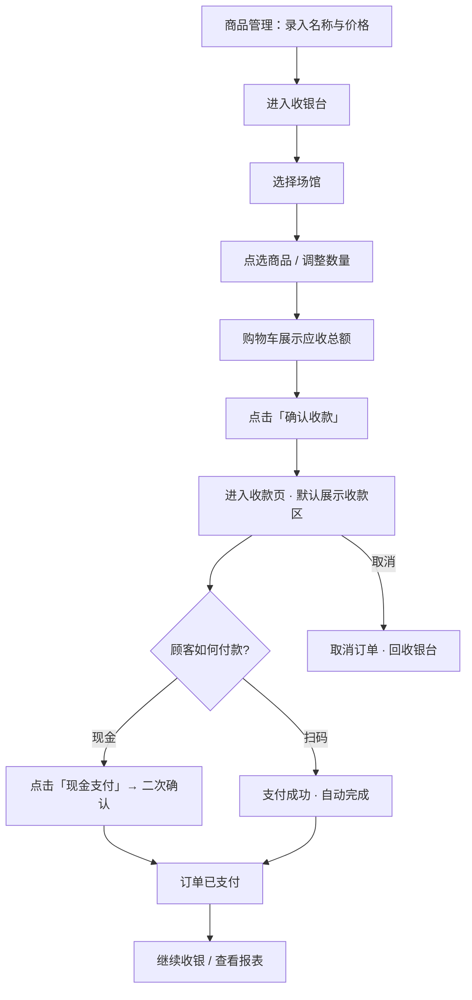

# B 端轻量收银 · 产品交互方案

> 版本：v1.0  
> 状态：已定稿讨论稿  
> 适用端：`sport-venue-merchant`（商户端）  
> 关联：`02-技术方案.md`

---

## 1. 产品定位

### 1.1 一句话

面向场馆商户的**轻量零售收银**：录入商品与价格 → 收银台选品计价 → 默认扫码收款，现金一键确认 → 按日查看销售。

### 1.2 解决什么问题

| 痛点 | 方案 |
|------|------|
| 场馆卖饮料/护具等，系统无商品能力 | 商品仅维护名称 + 价格，不绑库存 |
| 收银台操作步骤多，影响收客效率 | 确认金额后默认出收款码，常规无需再选支付方式 |
| 现金顾客也要走复杂流程 | 同一收款页提供「现金支付」，需要时才人工点一下 |
| 不知道今天卖了多少 | 日销售报表：笔数、金额、按商品、按支付方式 |

### 1.3 明确不做（本期）

- 库存入库 / 出库 / 预警
- 会员价、临时改价、折扣券（可后续加）
- 退款 / 部分退（可后续加）
- C 端小程序下单购商品（可后续加）
- 平台抽佣 / 分账

### 1.4 角色与端

| 角色 | 端 | 能力 |
|------|-----|------|
| 商户操作员 | Merchant 商户端 | 商品、收银、报表 |
| 平台管理员 | Admin（可选后续） | 全平台销售概览，本期可不做 |
| 顾客 | 无账号 | 扫收款码或付现金 |

---

## 2. 核心业务原则

1. **商品 = 名称 + 价格**，不与库存绑定。  
2. **销售流水以快照为准**：下单时固化商品名、单价，改价不影响历史。  
3. **默认扫码优先**：确认订单后进入收款页并展示收款区；顾客扫码即可完成。  
4. **现金是兜底**：仅当顾客付现金时，B 端点击「现金支付」完成。  
5. **数据按商户隔离**：只能看、管自己的商品与订单；订单须绑定所属场馆。

---

## 3. 用户故事

| ID | 作为… | 我希望… | 以便… |
|----|--------|---------|--------|
| US-01 | 商户 | 录入商品名称和价格 | 收银台能点选售卖 |
| US-02 | 商户 | 快速上下架商品 | 临时停售某些商品 |
| US-03 | 操作员 | 点选商品并改数量，看到总金额 | 快速报出应收款 |
| US-04 | 操作员 | 确认后默认展示收款码 | 顾客直接扫，我少点一步 |
| US-05 | 操作员 | 现金时点一次「现金支付」 | 现金单也能落账 |
| US-06 | 商户 | 按日看卖了哪些、多少钱 | 对账与经营复盘 |
| US-07 | 商户 | 区分现金与线上收款 | 核对钱箱与通道入账 |

---

## 4. 信息架构与导航

```
商户管理（Merchant）
├── 数据看板          /dashboard
├── 我的场馆          /venue/list
├── ★ 收银台          /cashier          ← 高频入口，建议置顶或次顶
├── ★ 商品管理        /products
├── ★ 销售报表        /sales/daily
└── 个人信息（已有）
```

**建议：** 「收银台」在侧栏中排在「我的场馆」之后，图标突出；有权限的操作员登录后可默认进收银台。

---

## 5. 端到端主流程

### 5.1 总览



### 5.2 日常扫码（目标路径 · 最少操作）

| 步骤 | 操作员动作 | 顾客动作 | 系统 |
|------|------------|----------|------|
| 1 | 点商品、改数量 | — | 实时算合计 |
| 2 | 点「确认收款」 | — | 创建待支付订单 + 展示收款页 |
| 3 | 把屏幕/码给顾客 | 扫码付款 | 回调成功 → 已支付 |
| 4 | 继续下一单 | — | 清空购物车 |

**操作员关键点击：** 选品若干次 + 确认收款（扫码成功无需再点）。

### 5.3 现金路径（例外路径）

| 步骤 | 操作员动作 | 系统 |
|------|------------|------|
| 1–2 | 同扫码路径到收款页 | 订单 PENDING |
| 3 | 收现金后点「现金支付」 | 二次确认弹窗 |
| 4 | 点「现金支付确认」 | PAID · pay_method=CASH |
| 5 | 继续下一单 | — |

### 5.4 取消

- 仅 **待支付** 订单可取消。  
- 收款页点「取消订单」→ 可选填原因 → 回收银台，购物车可清空或保留（**建议清空，避免脏数据**）。

---

## 6. 页面级交互说明

### 6.1 商品管理

**目的：** 维护可售商品池。

**列表能力：**
- 筛选：名称关键词、分类、状态（上架/下架）、场馆
- 操作：新增、编辑、上架/下架、删除（软删）
- 展示：名称、单价、单位、分类、所属场馆、状态、排序

**新增/编辑字段：**

| 字段 | 必填 | 说明 |
|------|------|------|
| 商品名称 | 是 | ≤100 字 |
| 单价 | 是 | > 0，两位小数 |
| 单位 | 否 | 默认「个」；可选瓶/份/条/套 |
| 分类 | 否 | 可输入或选已有；用于收银 Tab |
| 所属场馆 | 否 | 空 = 商户通用；有值 = 仅该场馆收银可见 |
| 排序 | 否 | 越大越靠前 |
| 备注 | 否 | 内部备注 |

**规则：**
- 已产生销售的商品：**禁止物理删除**，仅软删或下架。  
- 下架后：收银台不再展示；历史订单仍显示快照名称。

---

### 6.2 收银台（核心页）

**布局：** 左商品区（约 65%）+ 右购物车（约 35%）。

**顶部：**
- 当前场馆下拉（多场馆必选；单场馆自动选中并可隐藏）
- 操作员名称

**商品区：**
- 分类 Tab：全部 + 已有分类
- 商品卡片：名称、单价、单位；点击 = 数量 +1
- 无商品空态：「请先在商品管理中添加商品」→ 跳转链接

**购物车：**
- 行：名称、单价、数量 +/-、小计
- 数量为 0：移除该行
- 合计件数、应收金额
- 「清空」「确认收款」

**确认收款前置校验：**
- 已选场馆
- 购物车非空
- 金额 > 0

**确认后：** 创建订单并进入收款页（路由或全屏层，推荐独立路由以便刷新/轮询）。

---

### 6.3 收款页（默认扫码）

**信息区：**
- 大号应收金额
- 订单号、场馆、明细列表

**收款区（默认主视觉）：**
- Phase 1：二维码占位 + 文案「扫码支付即将接入，当前请使用现金支付」
- Phase 2：真实聚合码（或微信+支付宝并排）；文案「请顾客扫码支付」+ 等待中状态

**次要操作（底部）：**
- **现金支付**（主按钮样式可弱于扫码区，但足够醒目）
- **取消订单**

**现金二次确认弹窗：**
- 文案：应收 ¥XX，请确认已收到现金
- 按钮：取消 / 现金支付确认

**成功态：**
- 成功图标 + 金额 + 支付方式 + 订单号
- 「继续收银」「查看今日报表」

**轮询（Phase 2）：**  
进入收款页后每 2s 查订单状态；一旦 PAID → 自动进成功态，无需操作员点击。

---

### 6.4 日销售报表

**筛选：** 日期（默认今天）、场馆（全部/指定）

**汇总卡片：** 订单笔数、销售总额、销售件数、现金占比

**支付方式表：** 现金 / 微信 / 支付宝（Phase 1 后两者为 0）

**商品销售明细：** 名称、单价、销量、单位、销售额、涉及订单数

**下钻：** 「查看当日订单明细」→ 订单列表

---

### 6.5 订单明细

**筛选：** 日期、支付方式、状态（默认已支付）

**列表：** 订单号、时间、场馆、件数、金额、支付方式、查看详情

**详情：** 明细快照 + 支付信息（方式、时间、流水号）

---

## 7. 关键交互状态

| 场景 | 表现 |
|------|------|
| 确认收款加载中 | 按钮 loading，防重复提交 |
| 现金确认成功 | Toast + 成功页 |
| 扫码等待 | 「等待支付中…」弱动画；超时可选提示「仍未支付？」 |
| 网络失败 | Toast 错误，保留购物车 / 保留 PENDING 单 |
| 商品已下架却在购物车 | 确认时后端校验失败，提示并移除失效商品 |
| 无场馆 | 拦截进入收银，引导完善场馆 |

---

## 8. 分期交付（产品视角）

### Phase 1（本期）

| 模块 | 验收标准 |
|------|----------|
| 商品管理 | 可增改上下架；收银可见上架商品 |
| 收银台 | 选品、改数量、出合计、确认出单 |
| 收款页 | 有扫码占位区；现金二次确认可完成支付 |
| 报表 | 按日汇总总额/件数/按商品；支付方式含现金 |
| 数据隔离 | 商户 A 看不到商户 B 的商品与订单 |

### Phase 2（扫码）

| 模块 | 验收标准 |
|------|----------|
| 收款码 | 确认后展示可付真实码 |
| 自动完成 | 顾客付完，B 端无需点击即到成功页 |
| 报表 | 微信/支付宝有真实笔数与金额 |

### 可选后续

- 临时改价 / 整单折扣  
- 退款  
- 多操作员权限  
- C 端购商品  
- 导出 Excel  

---

## 9. 成功指标（上线后可观测）

| 指标 | 说明 |
|------|------|
| 单笔收银点击次数 | 扫码场景目标：选品 + 1 次确认 |
| 现金单占比 | 观察默认扫码是否降低人工干预 |
| PENDING 取消率 | 过高则需优化超时提示或误触 |
| 日报查看频次 | 验证对账价值 |

---

## 10. 产品定稿摘要

> **默认扫码、现金兜底的无库存轻量收银。**  
> 商户维护商品名称与价格；操作员选品确认后进入收款页（默认收款码）；顾客扫码自动完成，现金则点「现金支付」确认；按日统计商品销量与金额，并可区分支付方式。

---

*下一份文档：`02-技术方案.md` — 结合现有 sport-venue 微服务架构的落地设计。*
