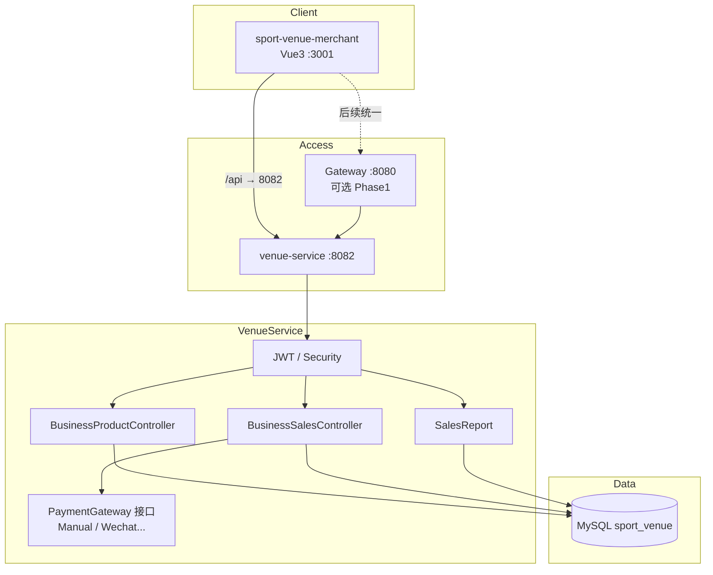
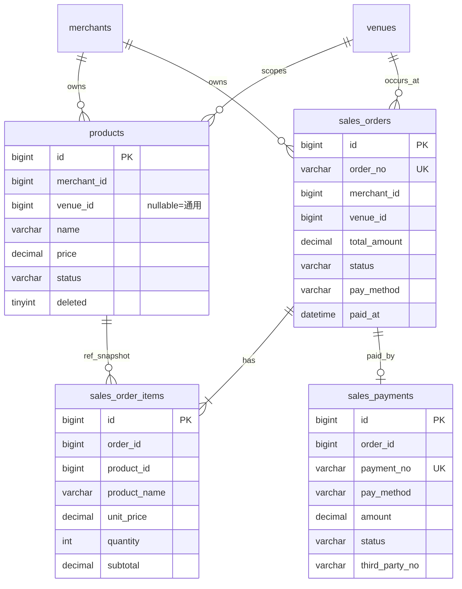
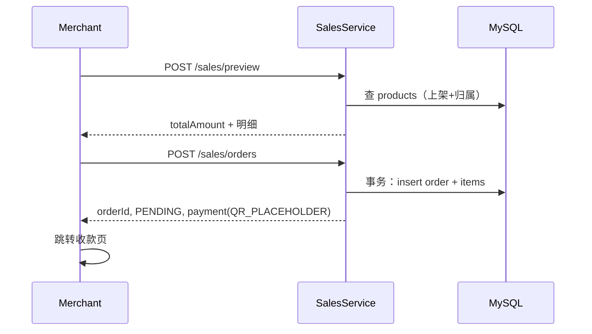
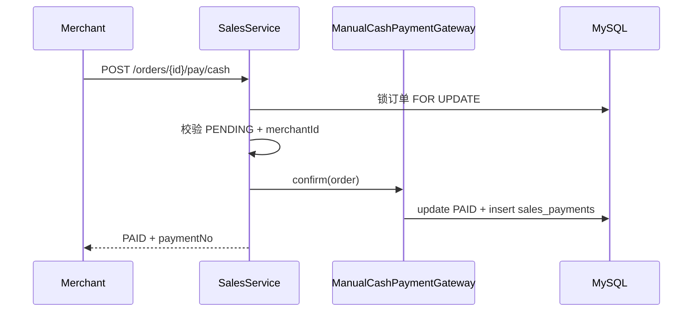
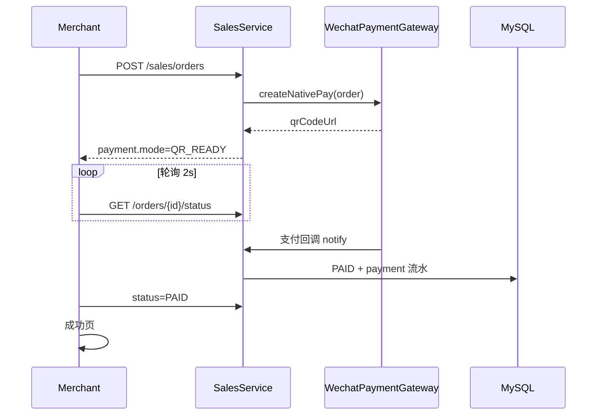

# B 端轻量收银 · 技术方案

> 版本：v1.0  
> 状态：已定稿讨论稿  
> 关联产品：`01-产品交互方案.md`  
> 对齐仓库：sport-venue（Spring Boot 3.2 / Spring Cloud 2023 / venue-service 核心）

---

## 1. 目标与约束

### 1.1 技术目标

在**不引入新微服务、不绑库存**的前提下，于现有架构中落地：

- 商品 CRUD  
- 销售单 + 明细快照  
- 现金支付确认（Phase 1）  
- 扫码支付扩展点（Phase 2）  
- 日销售统计  

### 1.2 与当前架构的对齐原则

| 原则 | 说明 |
|------|------|
| 能力落在 venue-service | 用户/场馆/商户已集中于此；收银同属 B 端经营域，避免过早拆 commerce |
| 沿用 ApiResponse / JWT | 与现有 `ApiResponse`、`JwtAuthenticationFilter` 一致 |
| Merchant 直连 8082 | 与现有 `vite.config.js` 一致；Gateway 路由修复可并行，不阻塞本期 |
| 配置进 config-repo | 支付开关、轮询间隔等走配置中心（本地 `*-local.yml`） |
| 表在 MySQL sport_venue | 与 venues / merchants 同库，便于 `merchant_id` / `venue_id` 校验 |

### 1.3 明确不做（技术侧）

- 新建 `commerce-service`（规模化后再拆）  
- Kafka / 分账 / 库存事务  
- 在 Gateway 先做支付回调（Phase 2 可直连 venue 或经 Gateway）  

---

## 2. 现状基线（实现前必须正视）

| 项 | 现状 | 对本模块影响 |
|----|------|----------------|
| Merchant 登录 | 前端 mock token | **必须先做真实登录 + JWT**，否则无法做商户隔离 |
| API 路径 | 前端 `/venues/merchant` vs 后端 `/venues/merchant/{id}` | 收银 API 统一新前缀 `/business/**`，避免继续错位 |
| Security | `ROLE_MERCHANT` 与 `B_MERCHANT` 可能不一致 | 统一商户角色名，收银接口要求商户身份 |
| Gateway | StripPrefix 后 venue 路径易 404 | Phase 1 Merchant 可继续直连 8082；文档预留 `/api/venue/business/**` |
| VenuePrice | 仅实体，无零售语义 | **不复用**；零售走 `products`，场地定价保持独立 |

---

## 3. 总体架构

### 3.1 逻辑架构



### 3.2 为何放在 venue-service

1. 订单强依赖 `merchant_id`、`venue_id` 归属校验，同进程查询成本最低。  
2. 当前 user / prediction / social 多为占位，再拆 commerce 运维成本 > 收益。  
3. 表结构与支付网关接口已预留边界，**日后可整体迁出为 commerce-service**。

### 3.3 模块包结构（建议）

```
com.sportvenue.venue
├── entity/
│   ├── Product.java
│   ├── SalesOrder.java
│   ├── SalesOrderItem.java
│   └── SalesPayment.java
├── repository/ ...
├── dto/sales/ ...
├── service/
│   ├── ProductService.java
│   ├── SalesService.java
│   ├── SalesReportService.java
│   └── payment/
│       ├── PaymentGateway.java          # 接口
│       ├── ManualCashPaymentGateway.java
│       └── (Phase2) WechatPaymentGateway.java
├── controller/
│   ├── BusinessProductController.java   # /business/products
│   └── BusinessSalesController.java     # /business/sales
└── resources/db/
    └── V3__sales_module.sql
```

---

## 4. 数据设计

### 4.1 ER



### 4.2 DDL 文件

路径：`sport-venue-venue/src/main/resources/db/V3__sales_module.sql`  

完整 SQL 见产品讨论稿 Phase 1 DDL（四表：`products` / `sales_orders` / `sales_order_items` / `sales_payments`）。

### 4.3 关键字段策略

| 策略 | 实现 |
|------|------|
| 价格快照 | `sales_order_items.product_name / unit_price / unit` |
| 软删除 | `products.deleted=1`，查询默认 `deleted=0` |
| 单号 | `SO`/`SP` + `yyyyMMdd` + 6 位序号（Redis INCR 或 DB 日序列表；Phase 1 可用 `Synchronized`+DB max 简化） |
| 报表时间 | 已支付单以 `paid_at` 归属自然日 |
| 索引 | `(merchant_id, paid_at)`、`(merchant_id, status, deleted)` |

### 4.4 与现有表关系

| 现有表 | 关系 |
|--------|------|
| `merchants` | `products.merchant_id` / `sales_orders.merchant_id` |
| `venues` | 下单校验场馆属于商户；`venue_id` 必填于订单 |
| `users` | `operator_id` = 当前登录用户 |
| `venue_prices` | **不关联**；场地定价与零售分离 |

---

## 5. API 设计

### 5.1 约定

- Base：`http://localhost:8082`  
- 前缀：`/business`  
- Header：`Authorization: Bearer {jwt}`  
- 响应：`ApiResponse<T>`（`code=200` 成功）  
- 商户身份：从 JWT 取 `userId` + `userType`，再解析 `merchantId`（User 表已有商户关联或登录时写入 claim）

### 5.2 接口清单

| 方法 | 路径 | 说明 | Phase |
|------|------|------|-------|
| GET | `/business/products` | 商品分页/列表 | 1 |
| GET | `/business/products/categories` | 分类去重 | 1 |
| POST | `/business/products` | 新增 | 1 |
| PUT | `/business/products/{id}` | 编辑 | 1 |
| PUT | `/business/products/{id}/status` | 上下架 | 1 |
| DELETE | `/business/products/{id}` | 软删 | 1 |
| POST | `/business/sales/preview` | 预览合计（不落库） | 1 |
| POST | `/business/sales/orders` | 创建 PENDING + 返回收款信息 | 1 |
| POST | `/business/sales/orders/{id}/pay/cash` | 现金确认 | 1 |
| POST | `/business/sales/orders/{id}/cancel` | 取消 PENDING | 1 |
| GET | `/business/sales/orders/{id}` | 详情 | 1 |
| GET | `/business/sales/orders/{id}/status` | 轻量状态（轮询） | 1/2 |
| GET | `/business/sales/orders` | 订单列表 | 1 |
| GET | `/business/sales/daily/summary` | 日汇总 | 1 |
| GET | `/business/sales/daily/products` | 日商品汇总 | 1 |
| GET | `/business/venues/mine` | 我的场馆 | 1 |

### 5.3 核心时序

#### 创建订单 → 收款页



#### 现金支付



#### Phase 2 扫码（预留）



### 5.4 Security 配置补丁

`SecurityConfig` 增加：

- `/business/**` 需认证，且 `hasAnyRole("MERCHANT","ADMIN")`（Admin 只读报表可后续细分）  
- 商户登录接口：`/auth/merchant/login`（或复用 `/auth/login` + `userType`）`permitAll`  
- 支付回调（Phase 2）：`/business/sales/payments/notify/**` `permitAll` + 签名校验  

### 5.5 Gateway（后续）

建议路由（与现有 `/api/venue/**` 对齐）：

```
/api/venue/business/**  →  lb://venue-service
  filters: StripPrefix=2   # /api/venue 去掉后保留 /business/**
```

或 Merchant 代理改为：

```
/api → http://localhost:8080/api/venue
```

**Phase 1 可不改 Gateway**，继续 `vite` 代理到 8082。

---

## 6. 领域服务设计

### 6.1 ProductService

- 列表：默认 `ON_SALE + deleted=0`；管理页可查全部状态  
- 收银列表：`venue_id IS NULL OR venue_id = :venueId`  
- 写操作：强制 `merchant_id = 当前商户`  
- 改价：只影响后续订单  

### 6.2 SalesService

| 方法 | 事务 | 说明 |
|------|------|------|
| preview | 否 | 实时价计算 |
| createOrder | 是 | 校验场馆归属、商品上架；写快照 |
| payByCash | 是 | 幂等：已 PAID 直接返回成功 |
| cancel | 是 | 仅 PENDING |
| getStatus | 否 | 供轮询 |

**幂等：** `pay/cash` 对同一 `orderId` 重复调用，若已 `PAID && CASH` 返回成功，不重复插支付流水。

### 6.3 SalesReportService

- `summary`：`GROUP BY pay_method` where `status=PAID` and `DATE(paid_at)=:date`  
- `products`：join items，按 `product_id`（或 name+price）聚合  
- 禁止跨商户  

### 6.4 PaymentGateway（扩展点）

```text
interface PaymentGateway {
  PaymentCreateResult createPay(SalesOrder order);   // Phase2 出码
  void confirmCash(SalesOrder order);                // Phase1
  void handleNotify(String channel, raw payload);    // Phase2
}
```

Phase 1 仅注入 `ManualCashPaymentGateway`；创建订单时 `payment.mode=QR_PLACEHOLDER`。

---

## 7. 前端技术方案（Merchant）

### 7.1 技术栈（已有）

Vue 3 + Vite + Element Plus + Pinia + Axios（port **3001**）

### 7.2 新增路由

```text
/cashier
/cashier/pay/:orderId
/products
/products/add
/products/edit/:id
/sales/daily
/sales/orders
```

### 7.3 状态建议

| Store | 内容 |
|-------|------|
| `useCashierStore` | 当前 venueId、购物车 items、预览金额 |
| `useMerchantStore` | token、merchantId、operator（替换 mock） |

购物车结构：

```js
{ productId, name, unit, unitPrice, quantity }
```

确认收款：`preview`（可选）→ `createOrder` → `router.push(/cashier/pay/:id)`。

### 7.4 收款页行为

| Phase | 行为 |
|-------|------|
| 1 | 展示占位码；现金按钮 → 二次确认 → `pay/cash` → 成功页 |
| 2 | 展示真实码；`setInterval` 调 `status`；PAID 自动成功；现金逻辑不变 |

### 7.5 代理

保持：

```js
proxy: { "/api": { target: "http://localhost:8082", changeOrigin: true } }
```

Axios `baseURL: "/api"`，请求路径写 `/business/...`（若现有拦截器有 `/api` 前缀，统一一处即可）。

---

## 8. 前置改造清单（阻塞项）

| 优先级 | 项 | 原因 |
|--------|----|------|
| P0 | 商户真实登录发 JWT | 隔离与审计 |
| P0 | JWT 携带 / 可查 merchantId | 所有 `/business` 过滤 |
| P0 | 统一 MERCHANT 角色 | Security 放行 |
| P1 | `/business/venues/mine` | 收银选场馆 |
| P2 | Gateway 路由修正 | 统一入口（非阻塞） |

**建议登录契约：**

```http
POST /auth/merchant/login
{ "username": "...", "password": "..." }

→ { token, merchantId, merchantName, userId, userName }
```

前端弃用 mock `merchantInfo`，改为真实 token；`request.js` 带 `Authorization`，可保留 `X-Merchant-ID` 作辅助但**以后端 JWT 为准**。

---

## 9. 配置与环境

### 9.1 application / config-repo

```yaml
sales:
  order-no-prefix: SO
  payment-no-prefix: SP
  qr-mode: PLACEHOLDER   # PLACEHOLDER | READY
  status-poll-seconds: 2
```

Phase 2 增加微信支付商户号、回调 URL、密钥等，放 `venue-service-local.yml` / 配置中心，**禁止提交密钥到仓库**。

### 9.2 数据库

本地：`localhost:3306` / Docker：`3307`（与现有文档一致）。  
执行 `V3__sales_module.sql`；JPA 可用 `ddl-auto: update` 辅助，但**以 SQL 脚本为准**入库。

---

## 10. 安全与合规

| 点 | 措施 |
|----|------|
| 越权 | 所有查询 `merchant_id = current`；改单前校验 |
| 重复支付 | 现金接口幂等；支付流水 `payment_no` 唯一 |
| 回调伪造（P2） | 验签 + 金额比对 + 订单状态机 |
| 金额 | `BigDecimal`；禁止 float |
| 审计 | `operator_id` / `operator_name` 快照 |

---

## 11. 测试要点

| 类型 | 用例 |
|------|------|
| 单测 | preview 合计；现金幂等；非 PENDING 不可现金 |
| 接口 | 跨商户访问商品/订单应 403 |
| 前端 | 空购物车不可确认；现金二次确认取消不落单 |
| 报表 | 改价后历史明细金额不变；按 `paid_at` 归属 |

---

## 12. 实施计划

| 阶段 | 内容 | 预估 |
|------|------|------|
| Sprint 0 | 商户登录 + merchantId + 角色修复 | 1–2 天 |
| Sprint 1 | DDL + Entity + 商品 API + 商品页 | 2 天 |
| Sprint 2 | 下单 / 现金 / 取消 + 收银台 + 收款页 | 3 天 |
| Sprint 3 | 日报 + 订单列表 + 联调验收 | 1–2 天 |
| **Phase 1 合计** | | **约 7–9 人日** |
| Phase 2 | PaymentGateway 微信/支付宝 + 回调 + 轮询 | 另估 |

---

## 13. 演进路径

```text
Phase 1  现金 + 占位码 + 报表
    ↓
Phase 2  真实扫码 + 自动完成
    ↓
可选     退款 / 折扣 / C 端购商品
    ↓
规模化   拆出 commerce-service，表与 PaymentGateway 原样迁移
```

---

## 14. 技术方案定稿摘要

> 在 **venue-service** 内新增 `/business` 零售收银域：四张表、商品与销售服务、`PaymentGateway` 扩展点。  
> Phase 1 实现商品、下单、**现金确认**、日报；收款页预留扫码 UI。  
> Merchant 端新增收银台 / 商品 / 报表三页；**先打通商户 JWT 与数据隔离**。  
> 不新建微服务、不绑库存、不复用 VenuePrice；与现有 Eureka / Config / MySQL / JWT 体系兼容，Gateway 可后续接入。

---

## 附录 A · 状态机

```text
销售单：
  PENDING ──pay/cash──► PAID
  PENDING ──cancel────► CANCELLED
  PENDING ──notify(P2)─► PAID
  PAID / CANCELLED 为终态
```

## 附录 B · 文档索引

| 文档 | 内容 |
|------|------|
| `01-产品交互方案.md` | 角色、流程、页面、分期验收 |
| `02-技术方案.md` | 本文件：架构、表、API、前后端、排期 |
| 仓库 README | 全局微服务愿景（本模块为其 B 端经营能力子集） |
